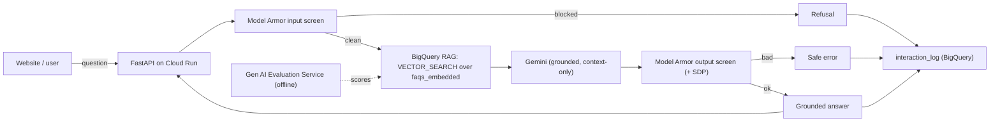

# Challenge Five — Architecture

Solution diagram and requirement mapping for the Alaska Department of Snow online agent. Backend is
`challenge-5-aaron.ipynb`; the deployable service is `main.py` + `index.html`.



## Requirement -> implementation
| Requirement | Implementation |
|---|---|
| Backend data store for RAG | Snow FAQs in BigQuery, embedded with `ML.GENERATE_EMBEDDING`, retrieved with `VECTOR_SEARCH` (Challenge 2) |
| Backend API functionality | `answer()` exposed via FastAPI `/ask` on Cloud Run (`main.py`) |
| Prompt filtering & response validation | Model Armor input + output templates (Challenge 1) |
| Log all prompts and responses | `interaction_log` BigQuery table |
| Unit tests | `pytest` via `ipytest` (grounding, injection, retrieval) |
| Evaluation data | `EvalTask` groundedness + instruction-following (Challenge 3) |
| Deployed to a website | Cloud Run service + `index.html` front end |

## Deploy
From the `challenge-5/` directory (which holds `main.py`, `requirements.txt`, `Procfile`):
```
gcloud run deploy snow-agent --source . --region us-central1 --allow-unauthenticated
```
Paste the service URL into `index.html` (`BASE`) and host the page (Cloud Storage static site, or
open locally to test).
